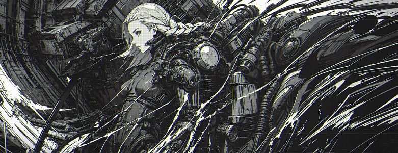

# Mardcelo Kim

##### Banner by @xenotrip

## Introduction

Mardcelo embodies the impermanence and mystery of life, like a fleeting illusion. Despite being labeled "half-drunk," his true nature remains hidden, a reminder that appearances can deceive. Mardcelo's existence shall be hidden

## "I Shall Die" 

## Research Areas 

- Windows Kernel 
- Drivers 
- Linux Kernel
- Quantum Physics 
- Mathematics
- Fuzzing
- Hyper-V
- Machine Learning 

## Quote 

### "Fighting with yourself rather than winning the battle Winning is much more valuable. Even if you win the battle now, someday He may lose, but he who wins the fight against himself Because we win forever."

## Mates 
- [0xAanon](https://github.com/yesmanno) 
- [Snowcrash](https://github.com/snowcra5h) 
- [Nop](https://github.com/nop-tech) 
- [Thorn](https://github.com/GuildedThorn)
- [Bakki](https://github.com/shubakki)
- [Niko](https://github.com/Exploitables/)
- [tr3sp4ss3r](https://github.com/tr3sp4ss3rexe)
- [Shelldon](https://github.com/Sh3lldon)
